<h1 align="center">👋 Hi, I'm Nicolas Fracchia</h1>

  Full Stack Software Developer
   
  Calgary, AB, Canada · Open to Opportunities

---

    
 <h3>🧠 Summary</h3> 

Strategic and goal-oriented Full Stack Software Developer with 15+ years of experience. I blend technical expertise with business acumen, leveraging my entrepreneurial background to deliver robust, scalable, and customer-centric solutions. I thrive in collaborative environments, proactively anticipate challenges, and optimize processes through thoughtful analysis and communication.

> **Soft Skills:**  
Communication · Leadership · Problem-solving · Resource Management · Analytical Reporting · Agile Collaboration · Growth Mindset

---

    
 <h3>💻 Key Skills</h3> 

- **Backend Development:** Python · FastAPI · Node.js · NestJS · PHP · RESTful APIs · JWT (JSON Web Tokens) · Secure authentication & access control · Keycloak · Server-Side Rendering (SSR) / Client-Side Rendering (CSR)  
- **Databases & ORM:** PostgreSQL · SQLAlchemy · Alembic · Prisma · Sequelize · Doctrine · Eloquent · MySQL · Database modeling and performance optimization
- **DevOps & Cloud:** Docker · GitHub Actions · Nginx · Linux VPS configuration · Domain setup · CI/CD pipeline creation
- **Authentication & Security:** JWT · Keycloak · OAuth · SOC2 & ISO 27001 Considerations  
- **Mobile Development:** React Native · IONIC · Hybrid mobile applications · Play Store & App Store deployment
- **Frameworks:** FastAPI · NestJS · ReactJS / React Native · Next.js · ExpressJS · Symfony · Laravel
- **Frontend Development:** React · Next.js · HTML5 · CSS3 · JavaScript · Tailwind CSS · SEO · Schema Marckup  

---

    
 <h3>💼 Work Experience</h3> 

#### 🔸 **Full-Stack Software Developer | Part-time | Y-Swipe**
###### Calgary, AB, Canada | December 2024 – Present

    
Experience details:

- Developing and maintaining a high-performance API for Y-Swipe using Python, FastAPI, SQLAlchemy ORM and Alembic for migrations, and PostgreSQL.
- Implementing secure authentication and access control mechanisms using Keycloak.
- Containerizing backend services using Docker to streamline development and deployment workflows.
- Analyzing business requirements to design scalable data models and ensure long-term platform adaptability.
- Optimizing backend architecture for performance, maintainability, and scalability.
- Collaborating with product and engineering teams to align development efforts with business goals.
- Contributing to the platform's security strategy, with considerations for SOC2 and ISO 27001 compliance.
- Participating in sprint planning, standups, and retrospectives within a Scrum framework using Jira.
- Coordinating with frontend developers and other stakeholders in a cross-functional team environment.
- Proactively identifying opportunities for technical and process improvements to support product growth.  

  

> ###### _**Tech Stack:**  Python · FastAPI · SQLAlchemy ORM · Alembic (migrations) · PostgreSQL · Docker · Keycloak · Jira · Scrum_

#### 🔸 **Full-Stack Software Developer | Short-term contract | Communet**
###### Calgary, AB, Canada | December 2024 – March 2025

    
Experience details:

- Designed and developed a RESTful API for a networking and community platform using NestJS, Prisma ORM, and PostgreSQL.
- Implemented secure user authentication and authorization using JWT.
- Integrated backend services seamlessly into a Next.js frontend application, ensuring smooth data flow and consistency.
- Developed and maintained a CI/CD pipeline with GitHub Actions to automate deployment workflows for both frontend and backend projects.
- Configured and optimized a Linux-based VPS server, deploying the platform using Nginx for efficient hosting.
- Managed domain configuration in GoDaddy, linking custom domains to the VPS server.
- Conducted database modeling and performance optimization to support scalable platform features.
- Ensured code quality and maintainability by applying clean architecture principles and modular design patterns.
- Collaborated in a cross-functional Scrum team, participating in sprint planning, code reviews, and daily standups.
- Delivered production-ready software under tight deadlines.  

  

> ###### _**Tech Stack:**  NestJS · Prisma ORM · PostgreSQL · JWT · Next.js · GitHub Actions (CI/CD) · Nginx · Linux VPS · GoDaddy · Scrum_

#### 🔸 **Full-Stack Software Developer | PathwayPro**
###### Calgary, AB, Canada | September 2024 – November 2024

    
Experience details:

- Developed responsive UI components using ReactJS and NextJS, integrating RESTful APIs.
- Built a CMS with JWT authentication, enabling dynamic content management and client usability.
- Combined Server-Side Rendering (SSR) and Client-Side Rendering (CSR) to optimize UX and SEO.
- Collaborated with multicultural Agile teams, actively participating in Scrum ceremonies.

  

> ###### _**Tech Stack:** ReactJS · NextJS · Node.js · NestJS · Prisma ORM · PostgreSQL · JWT · Docker · GitHub Actions · Scrum_

#### 🔸 **Full-Stack Developer | Independent Contractor**
###### Calgary, AB & Buenos Aires, Argentina | August 2019 – August 2023

    
Experience details:

- Designed and developed custom Progressive Web Apps (PWAs) and responsive websites for diverse clients.
- Implemented and optimized RESTful APIs to enhance backend service interactions.
- Built hybrid mobile applications using React Native, deployed on both Google Play and App Store.
- Developed stock management and shipment tracking solutions for a sublimation factory, synchronizing with e-commerce platforms.
- Created and maintained specialized CMS solutions for journalists in various industries.  

  

> ###### _**Tech Stack:** React Native · JavaScript · HTML/CSS · REST APIs · PostgreSQL · WordPress · CMS tools · PWA_

#### 🔸 **Co-founder & Full-Stack Software Developer | Proweb Solutions**
###### Buenos Aires, Argentina | January 2018 – August 2019

    
Experience details:

- Managed client requirements and collaborated with the design team to deliver intuitive web and mobile solutions.
- Created responsive websites and mobile apps, deployed to the Play Store and App Store.
- Developed internal tools, including CMS, intranets, and extranets, integrating Google and third-party APIs.
- Educated clients with diverse technical knowledge on product use and maintenance.
- Led meetings to present technical solutions and roadmaps to stakeholders.  

  

> ###### _**Tech Stack:**  JavaScript · HTML/CSS · React Native · Google APIs · CMS · Play Store & App Store deployment_

#### 🔸 **Senior Full-Stack Software Developer | BDT Global SRL/Ltd.**
###### Buenos Aires, Argentina | November 2014 – May 2019

    
Experience details:

- Engineered enterprise applications for insurance, public energy, and healthcare sectors using JavaScript, PHP, and Node.js.
- Improved processing speeds and reporting systems for internal applications.
- Designed integrated systems for insurance companies, enhancing CMS capabilities for claims processing.
- Built mobile apps and web solutions tailored to enterprise requirements.
- Mentored new team members, ensuring high-quality software development practices.  

  

> ###### _**Tech Stack:** JavaScript · PHP · Node.js · MySQL · Enterprise CMS · Mobile App Development_

#### 🔸 **Intermediate Full-Stack Software Developer | DOMO Solutions SRL/Ltd.**
###### Buenos Aires, Argentina | November 2011 – July 2014

    
Experience details:

- Developed custom full-stack CMS solutions using HTML, CSS, JavaScript, AJAX, and MySQL.
- Integrated SOAP web services for government websites, ensuring secure data exchange.
- Utilized frameworks like Zen Framework, Drupal, and WordPress for diverse client projects.
- Collaborated with clients to enhance system functionalities and address unique requirements.  

  

> ###### _**Tech Stack:** HTML · CSS · JavaScript · AJAX · MySQL · SOAP Web Services · Zend Framework · Drupal · WordPress_

---

    
 <h3>🎓 Education</h3> 

**Full-Stack Software developer Bootcamp (intensive)**  
_University of Calgary, CA, AB (Robo Garden) | September 2023 to March 2024_

**Course in React – Hooks, Router, Redux, NextJS**  
_Distance learning (Udemy) | January 2022 to March 2022_

**Course in Mobile App Development with React Native**  
_distance learning (edX - Harvard University) | January 2020 to February 2020_

**Course in Advanced JavaScript**  
_IT Master Academy, Argentina | January 2015 to March 2015_  

**Course in PHP – Object-Oriented Programming**
_Educacion IT, Argentina | January 2012 to January 2012_  

**Certificate in Intermediate (B1) General English as a Foreign Language (exchange student)**
_LAL Language Centres, Torquay, UK | January 2011 to February 2011_  

**Certificate in Web Development**  
_A.U.B.A, Argentina | January 2010 to October 2010_  

---

    
 <h3>🌐 Languages</h3> 

- 🇪🇸 Spanish: Native  
- 🇬🇧 English: Advanced 

---

### ✨ Let's Connect!

If you're looking for a passionate, experienced, and thoughtful developer to join your team or collaborate on meaningful projects — let’s chat!

---

  

---
